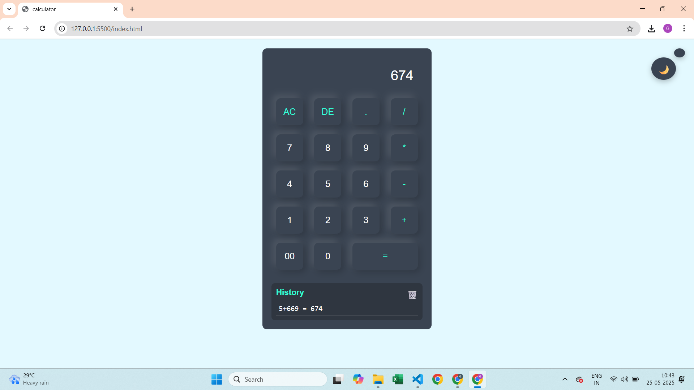
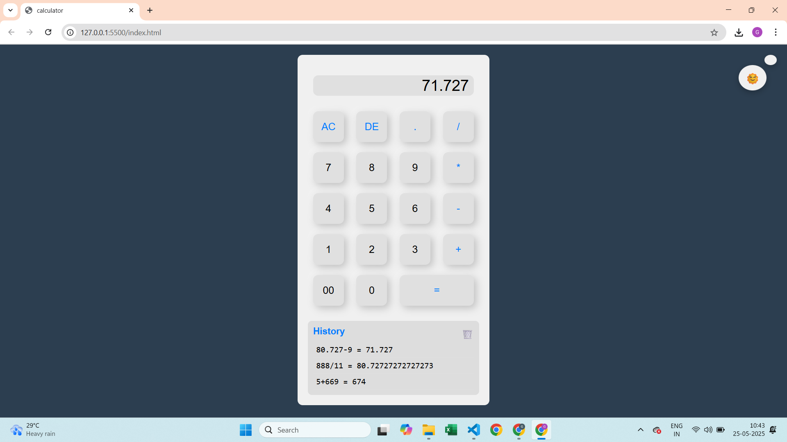
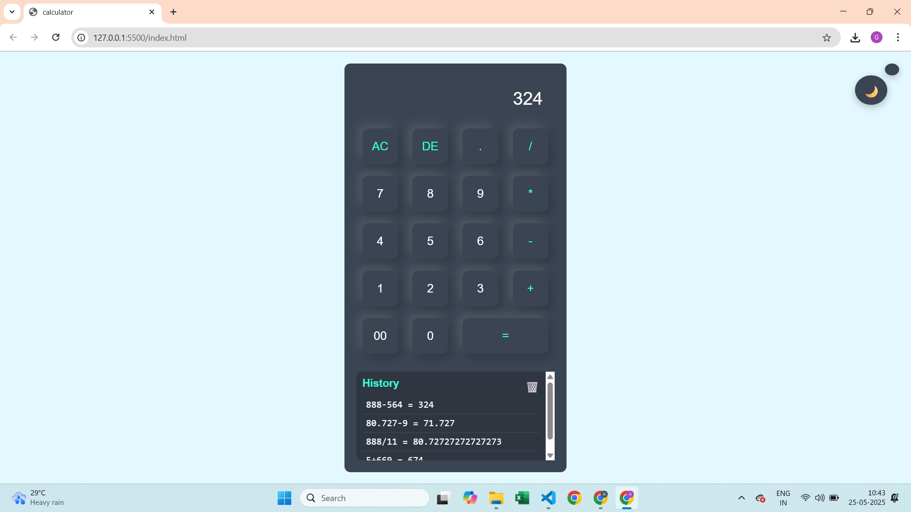
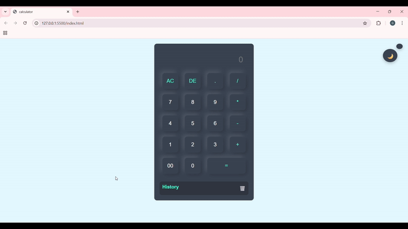

# Themed Calculator App


A sleek and modern calculator web app that supports dark/light themes, shows your last 10 calculations, and works beautifully on all devices. Built with HTML, CSS & JavaScript — no frameworks, just clean code. 🧮⚡

---

## 🚀 Features

- **✅Dark and Light Theme Toggle:** Switch between themes with a smooth animated icon.
- **✅Calculation History:** View the last 10 calculations with results.
- **✅Clear History:** Ability to clear all history with a single click.
- **✅Responsive Design:** Works well on both desktop and mobile devices.
- **✅Basic Calculator Functions:** Addition, subtraction, multiplication, division, decimal support, clear, and delete.
- **✅User-friendly UI:** Clean, modern look with smooth transitions.

---

## 🌐 Live Demo  
👉 [Try it here](https://your-demo-link.netlify.app)

---

## 📸Screenshots

### 🌙 Dark Mode


### ☀️ Light Mode


### 🧠 History in Action


---

## 🎥 Demo in Action


---

## 🛠 Tech Stack

- **HTML5** — Structure and markup
- **CSS3** — Styling, including CSS variables for theme support and responsiveness
- **JavaScript (ES6)** — Logic for calculator operations, theme toggling, and history management

---

## 📥 Getting Started

1. **Clone the repository:**

```bash
git clone https://github.com/mohitgundal/Calculator-App.git
```


2. **Navigate to the project folder:**

```bash
cd Calculator-App
```


3. **Open index.html in your favorite browser:**

You can simply double-click the index.html file or serve it with a local server if needed.


## 📘 How to Use
Click the calculator buttons to input numbers and operations.

- Use buttons to input values and operations
- = calculates the result
- AC clears the entire input
- DE deletes the last digit
- 🌓 icon toggles theme
- View last 10 calculations in the history pane
- 🗑️ deletes all history


## 📁 Folder Structure
```plaintext
Calculator-App/
├── index.html       # Main HTML file
├── style.css        # CSS for styling and themes
├── script.js        # JavaScript for calculator logic and theme toggle
└── README.md        # This file
```

## 🤝 Contribution
Contributions are welcome!
- 🍴 Fork the repo
- 🔧 Make your changes
- 📩 Submit a pull request
Issues and feature ideas are also appreciated.

## 📄 License
Licensed under the MIT License – see the LICENSE file for details.


## 🙋‍♂️ Author  
Made with ❤️ by **Mohit Gundal**
Let’s connect: 

📫 [LinkedIn](https://www.linkedin.com/in/mohitbuilds/) • 🌐 [mohitbuilds.com](https://mohitbuilds.com) • 📷 [Instagram](https://www.instagram.com/_mohitbuilds/)


## 🙏 Thank you for visiting!
If you found this project helpful, consider giving it a ⭐ on GitHub — it helps a lot!
